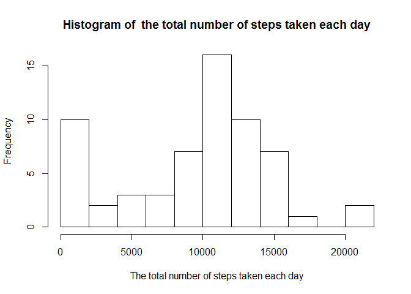
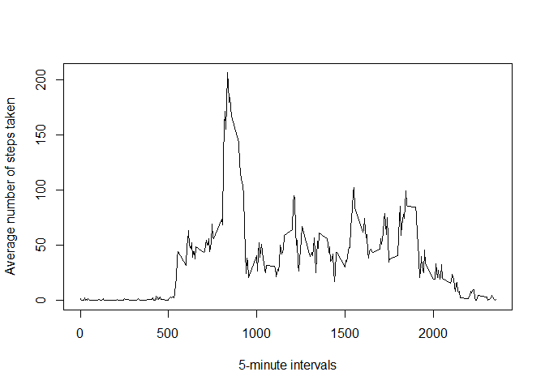
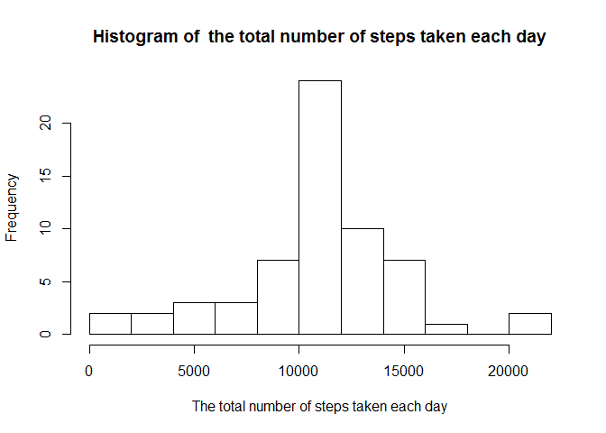
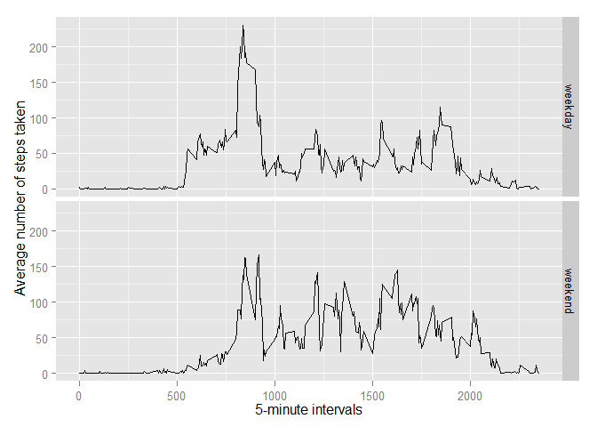

# Reproducible Research: Peer Assessment 1


## Loading and preprocessing the data

In this part we load some useful packages and load and read the data.


```r
library(dplyr)
```

```
## 
## Attaching package: 'dplyr'
## 
## The following object is masked from 'package:stats':
## 
##     filter
## 
## The following objects are masked from 'package:base':
## 
##     intersect, setdiff, setequal, union
```

```r
library(data.table)
```

```
## 
## Attaching package: 'data.table'
## 
## The following objects are masked from 'package:dplyr':
## 
##     between, last
```

```r
library(ggplot2)
activity <- read.csv(unzip("activity.zip", "activity.csv"))
Sys.setlocale("LC_ALL","English")
```

```
## [1] "LC_COLLATE=English_United States.1252;LC_CTYPE=English_United States.1252;LC_MONETARY=English_United States.1252;LC_NUMERIC=C;LC_TIME=English_United States.1252"
```

## What is mean total number of steps taken per day?

For this part of the assignment we group the data by date and calculate the total number of steps taken per day.


```r
by_date <- group_by(activity, date)
sum_by_date <- summarize(by_date, 
                         sum(steps, na.rm = TRUE))
aver <- mean(sum_by_date$sum)
mer <- median(sum_by_date$sum)
```

Here you can see a histogram of the total number of steps taken each day:


```r
hist(sum_by_date$sum, 
     breaks = 8, 
     main = "Histogram of  the total number of steps taken each day", 
     xlab = "The total number of steps taken each day")
```

 

Now we need to know the mean and the median of the total number of steps taken per day.


```r
aver <- mean(sum_by_date$sum)
med <- median(sum_by_date$sum)
```

So, mean = 9354.2295082 and median = 10395.

## What is the average daily activity pattern?

For this part of the assignment we group the data by interval and calculate the average number of steps taken, averaged across all days.


```r
by_interval <- group_by(activity, interval)
mean_by_interval <- summarize(by_interval, 
                              mean(steps, na.rm = TRUE))
names(mean_by_interval) <- c("interval", "mean")
```

Here you can see a time series plot:


```r
plot(mean_by_interval$interval, 
     mean_by_interval$mean, 
     type = "l",
     xlab = "5-minute intervals",
     ylab = "Average number of steps taken")
```

 

To answer the question "Which 5-minute interval, on average across all the days in the dataset, contains the maximum number of steps?" we used the following code:


```r
max_int <- mean_by_interval[which.max(mean_by_interval$mean),1]
```

The resulting interval is 835.

## Imputing missing values

This part of the assignment concerning the impact of imputing missing data. The total number if missing values is the following:


```r
sum(is.na(activity))
```

```
## [1] 2304
```

To fill in all of the missing values we used average number of steps taken for the corresponding 5-minute interval which we have recieved previously. We created a new dataset that is equal to the original dataset but with the missing data filled in.


```r
activity1 <- activity
for (i in 1:nrow(activity1)){
        if (is.na(activity1[i,1])){
                activity1[i,1] <- mean_by_interval[which(mean_by_interval$interval == activity1[i,3]),2]
        }
}
```

Then we made a histogram of the total number of steps taken each day and calculated the mean and median total number of steps taken per day.


```r
by_date1 <- group_by(activity1, date)
sum_by_date1 <- summarize(by_date1, 
                         sum(steps))
hist(sum_by_date1$sum, 
     breaks = 8, 
     main = "Histogram of  the total number of steps taken each day", 
     xlab = "The total number of steps taken each day")
```

 

```r
aver1 <- round(mean(sum_by_date1$sum))
med1 <- round(median(sum_by_date1$sum))
```

So, the mean and the median in differ from the estimates from the first part of the assignment. As we can see, the mean and the median from the first part of the assignment (9354.2295082 and 10395 accordingly) is lower then after filling in missing data (1.0766\times 10^{4} and 1.0766\times 10^{4})

## Are there differences in activity patterns between weekdays and weekends?

Here we created a new factor variable in the dataset with two levels - "weekday" and "weekend" indicating whether a given date is a weekday or weekend day.


```r
activity1 <- transform(activity1, date = strptime(date, "%F"))
activity1[,"weekend"] <- NA
for (i in 1:nrow(activity1)){
        if ((weekdays(activity1[i,2]) == "Sunday") || (weekdays(activity1[i,2]) == "Saturday")){
                activity1[i,4] <- "weekend"
        } else {activity1[i,4] <- "weekday"}
}
```

And made a panel plot containing a time series plot (i.e. type = "l") of the 5-minute interval (x-axis) and the average number of steps taken, averaged across all weekday days or weekend days (y-axis).


```r
activity1 <- as.data.table(activity1)
activity1 <- activity1[, mean(steps), by = "interval,weekend"]
activity1 <- transform(activity1, weekend = as.factor(weekend))
qplot(interval, V1, data = activity1, 
      facets = weekend ~ ., 
      geom = "line", 
      xlab = "5-minute intervals",
      ylab = "Average number of steps taken")
```

 
